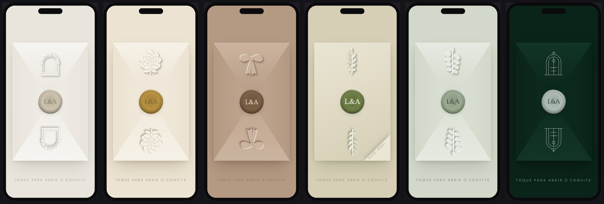
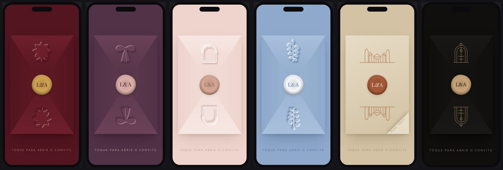

# Estúdio de Convites

Gerador de convites de casamento animados. Você preenche um formulário, vê o
convite ao vivo e baixa um site pronto para publicar.

**Criar um convite novo não gasta nenhum token de IA.** O motor de animação já
está escrito; cada convite é só dado preenchido num formulário.

---

## Como usar

1. Abra `estudio.html` com dois cliques (qualquer navegador, funciona offline).
2. Escolha um dos 6 templates.
3. Preencha os campos. A prévia atualiza sozinha no celular da direita.
4. Clique no envelope da prévia para testar a abertura.
5. **Gerar site do convite** → baixa um `index.html`.

### Publicar

Arraste o `index.html` em [app.netlify.com/drop](https://app.netlify.com/drop).
O link sai no ar na hora. Depois é só apontar um subdomínio
(`rebeca-newley.seudominio.com`) para ele.

O arquivo é **um só** — fotos, animação e estilos vão todos embutidos.
Nada de servidor, banco de dados ou build.

### Salvar e retomar

**Salvar projeto** baixa um `.json` com tudo (inclusive as fotos).
**Abrir projeto** carrega de volta. Use isso quando a noiva pedir alteração:
abre, muda, gera de novo.

---

## O que entra no convite

Envelope com lacre e relevo · capa com monograma · contagem regressiva ·
nossa história · cerimônia e recepção com link do Maps · dress code ·
galeria · RSVP por WhatsApp · PIX com botão de copiar · música ·
card de prévia do WhatsApp (Open Graph).

Cada bloco só aparece se você preencher. Deixou vazio, some.

---

## Cartela de templates

Doze paletas. Cada uma sai de um tema com demanda medida, não de gosto.

| Template | Família | Vem de |
|---|---|---|
| Cloud Dancer | off-white suave | cor do ano 2026 |
| Marfim | marfim e ouro | convenção da papelaria clássica |
| Mocha | mocha mousse, nude amadeirado | paleta terrosa de 2026 |
| Oliva | verde oliva e linho | casamento ao ar livre, o pedido padrão |
| Sálvia | sálvia, off-white, champanhe | paleta anunciada dominante para 2027 |
| Esmeralda | esmeralda, prata, preto | salão à noite |
| Borgonha | borgonha e dourado | inverno e catedral |
| Ameixa | ameixa e rosé | saturação alta, tendência 2027 |
| Blush | rosé e laço | coquette; busca por renda subiu 280% |
| Serenity | azul sereno, lacre branco | a paleta que mais viralizou no nicho |
| Toscana | terracota, cipreste, sol | destination wedding |
| Linho | preto real e tan | urbano, à noite, sem bege |

Cada template troca também o par tipográfico. Mesma serifada em tudo faz
doze convites virarem um.




## Acabamento

Detalhes que separam papelaria de texto de site:

- **Pais dos noivos** em duas colunas com filete, acima da linha de convite.
  No convite brasileiro é quase obrigatório e vinha faltando. Empilha
  sozinho em tela estreita para o nome não quebrar no meio.
- **Coroa de louros** em volta do monograma da capa.
- **Filete com losango** ao centro, não dois pontos.
- **Algarismos antigos** nas datas (numeral que sobe e desce acompanha a
  serifada) e tabulares na contagem, onde a largura precisa ser fixa.
- **Ligaduras e kerning** ativados nas serifadas.
- **Quebra equilibrada** nos títulos: sem última linha com uma palavra só.
- **Letterpress** no monograma: afundado no papel, não impresso em cima.
- **Borda deckle** na carta, por deslocamento com ruído.
- **Contorno de sombra** nas pétalas. Sem ele as camadas viram uma massa só,
  porque o relevo cego contorna apenas a silhueta externa.
- **Sobretítulo** opcional. A skill de design bane o rótulo acima do título
  em absoluto, mas na papelaria de casamento é convenção do gênero
  (*TOGETHER WITH THEIR FAMILIES*, *KINDLY RSVP*). Usado com parcimônia,
  não em toda seção.

## Mídia — o que separa caro de barato

A análise do código dos concorrentes premium mostrou o seguinte: cada convite
carrega de 4 a 24 arquivos de mídia. Dois dos vídeos têm nome de arquivo
começando com `kling_` — são gerados no **Kling AI**, não animados em CSS.

Quer dizer: a abertura do envelope deles é um **vídeo gerado por IA**, não
código. É por isso que parece cinema e tipografia sobre cor chapada não parece.

O estúdio tem três campos para isso:

| Campo | O que faz |
|---|---|
| Vídeo de abertura (cortina) | Vira a abertura. O envelope em CSS sai de cena |
| Imagem ou vídeo de fundo da capa | Entra atrás do nome do casal, com véu por cima |
| Textura de fundo da página | Aquarela ou linho atrás do convite inteiro |

O véu é o que mantém o texto legível sobre foto. Foto clara pede véu mais forte.

Sem nenhum desses campos o convite continua funcionando — abre com o envelope
em CSS e fica bonito. Mas é com eles que ele fica caro.

## Trocar o ornamento — o que mais sobe o nível

Os florais do envelope são vetores autorais. Funcionam, mas não competem com
aquarela botânica de verdade, e é aí que mora a diferença entre "bonito" e
"a noiva mandou pro noivo na hora".

O campo **Ornamento próprio** no estúdio aceita a URL de um PNG ou SVG. Com
ele preenchido, sua arte entra no lugar do vetor. Uma aquarela botânica boa
sai por volta de R$ 30 no Creative Market ou Freepik e serve para todos os
convites — é o melhor dinheiro que dá pra gastar nisso.

Use PNG com fundo transparente, 1200px de largura, na proporção do motivo
(largo e baixo, tipo 200×110). Para manter o convite em um arquivo só,
converta para data URI antes de colar.

---

## Estrutura dos arquivos

```
estudio.html       ← o que você usa (gerado, não edite)
estudio.src.html   ← fonte do painel
engine/
  templates.js     ← paletas, fontes, motivos (adicionar template é aqui)
  invite.css       ← estilo do convite
  invite.js        ← renderizador e animações
build.sh           ← junta tudo em estudio.html
exemplos/          ← convites já gerados
```

Mexeu em `engine/` ou `estudio.src.html`? Rode `./build.sh`.

### Adicionar um template

Copie um objeto em `engine/templates.js`, troque as cores e rode `./build.sh`.
São 12 linhas e nenhum código novo.

---

## Detalhes que importam

**Música.** Só começa depois do toque no envelope — é o gesto do usuário que
libera o áudio. Nenhum navegador bloqueia desse jeito.

**Fotos.** São reduzidas automaticamente antes de entrar no arquivo. Um convite
com 6 fotos fica em torno de 1,5 MB. Sem fotos, 42 KB.

**Card do WhatsApp.** A imagem do card precisa de URL absoluta (não entra
embutida). Hospede o JPG 1200×630 junto do convite e cole o endereço completo.

**RSVP.** Um botão só, levando ao WhatsApp. É proposital: a reclamação mais
comum de convidado é não saber por onde confirmar.

---

## Só quero ver os convites

Abra `convites/index.html`. Lista os doze, clique para abrir.
Não precisa do estúdio para isso: o estúdio é para criar um convite novo.

Cinco já estão com arte de verdade (Marfim, Cloud Dancer, Mocha, Oliva,
Sálvia), gerada no Flow e guardada em `arte/`. Os outros sete usam o
envelope desenhado em CSS até a arte chegar.

## Três formas de abrir

O motor escolhe sozinho, pela ordem:

| Campo preenchido | O que acontece |
|---|---|
| Vídeo de abertura (cortina) | O vídeo é a abertura; revela quando termina |
| Foto do envelope | A foto é o envelope; some com um leve zoom ao toque |
| Nenhum dos dois | Envelope desenhado em CSS, com aba, lacre e relevo |

Foto boa e vetor desenhado brigando na mesma tela é pior que qualquer um
dos dois sozinho, por isso a foto substitui o envelope em vez de ficar
atrás dele.
